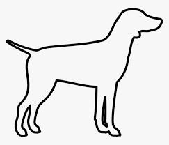

### Growing Neural Gas
Simple Python implementation of the GNG algorithm

### To Run
1. Install Miniconda
2. Create the conda environment from environment.yml using `conda env create -f environment.yml`
   - OpenCV
   - Matplotlib
   - Numpy
3. Run the main.py with the following command-line arguments
   - `-i` for input image (default 'data/dog.png')
   - `-e` for training epochs (default 10k)
e.g. 'python main.py -i data/human.jpg -e 50000

### Results

Original             |  GNG
:-------------------------:|:-------------------------:
  |  
 |  
    |  

Tested and developed with Python 3.10 and Ubuntu 20.04 LTS